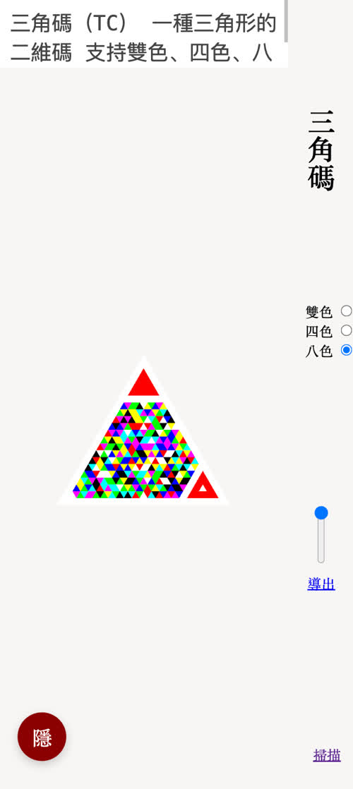
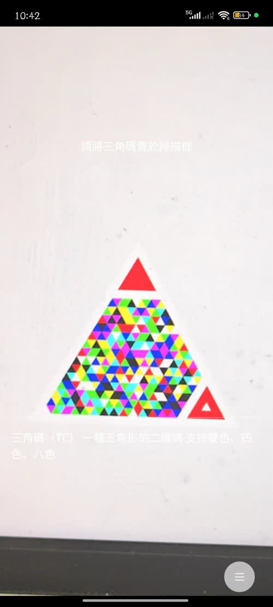

# 三角碼（tricode）

一種三角形的二維碼

* 外觀為三角形
* 支持雙色、四色、八色

[體驗一下](https://lizongying.github.io/tricode/)




## Getting Started

* 生成三角碼

```html

<script type="module">
    import {Generator} from 'tricode'

    const container = document.querySelector('#container')
    let text = '三角碼'
    let size = 200
    let withSvg = false

    // 1 雙色
    // 2 四色
    // 3 八色
    let colorType = 3

    let generator = new Generator(
            text,
            colorType,
            size,
            withSvg,
    )

    // 注意，svg在小米等手機的暗黑模式下的顏色會被修改。
    // 注意，為了視覺體驗，生成的canvas會被放大10倍。
    container.appendChild(withSvg ? generator.getSvg() : generator.getCvs())
</script>
```

## 讚賞

