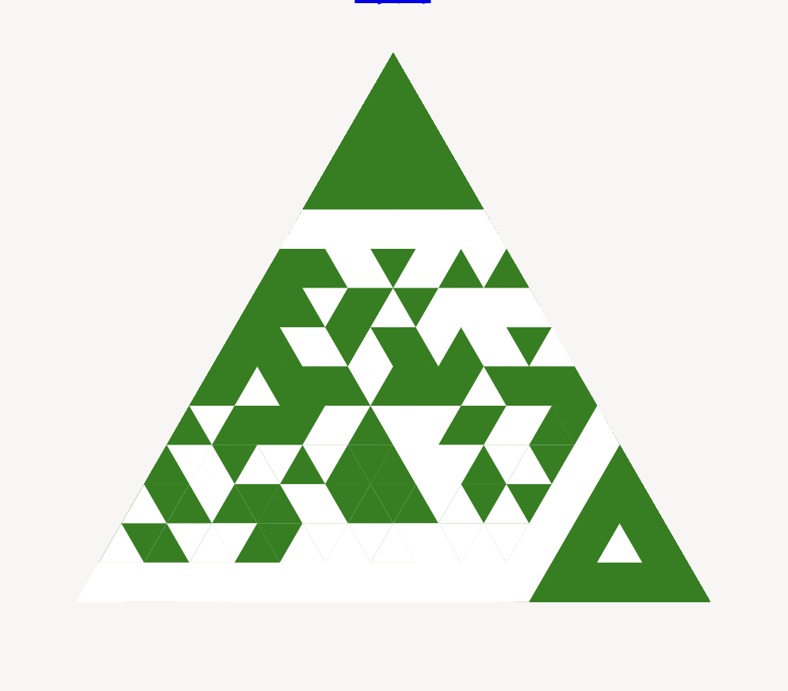

# 三角碼

一種三角形的二維碼，js實現

別名：金字塔碼（Pyramid Code）

* 外觀為三角形，和常見的二維碼很大不同，可能適合特殊領域或商品

[doc](https://lizongying.github.io/triangular-code/)

[npm](https://www.npmjs.com/package/triangular-code/)

[js](https://github.com/lizongying/triangular-code/)

[python](https://github.com/lizongying/triangular-code/)

[rust](https://github.com/lizongying/triangular-code/)



## 使用

### node

```
npm i triangular-code
```

### browser

```html
```

## 讚賞

